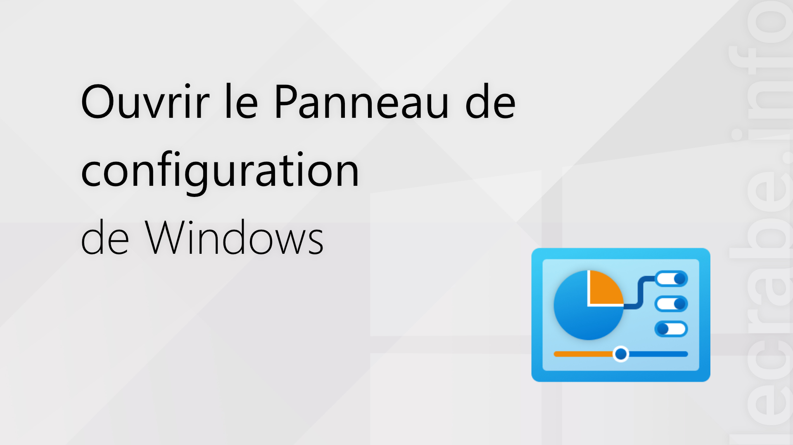
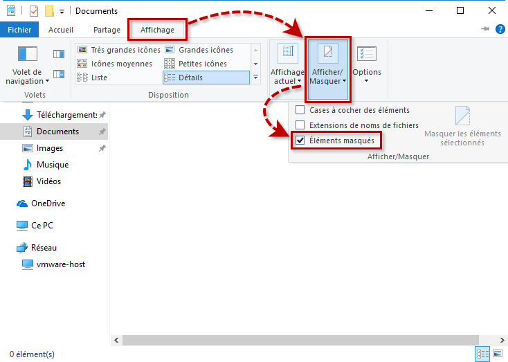
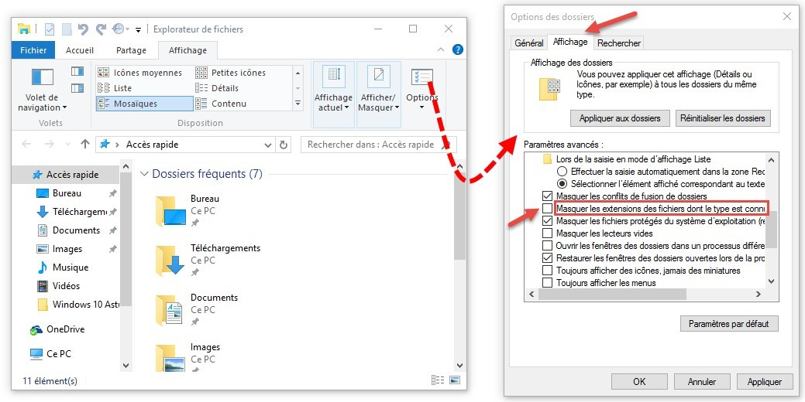
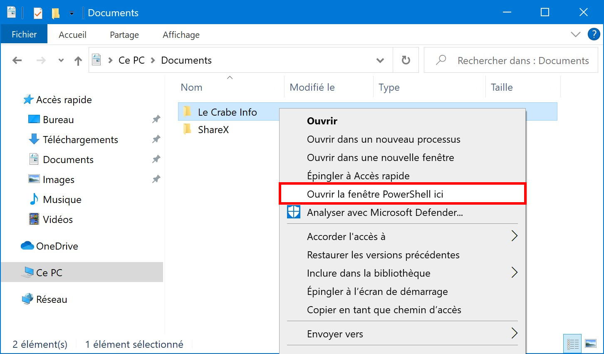

# Configuration windows

{:width="500px" }
*Configuration windows*

<!-- note -->

Pour configurer un poste Windows pour un développeur, vous pouvez suivre ces étapes suivants

<!-- new slide -->

## Affichage des fichiers cachés :

{:width="500px" }
*Affichage des fichiers cachés*

<!-- note -->

- Ouvrez l'explorateur de fichiers.
- Allez dans l'onglet "Affichage" dans la barre de menu.
- Cochez la case "éléments masqués" dans le groupe "Options".
- Les fichiers cachés seront maintenant visibles.

<!-- new slide -->

## Affichage des extensions des fichiers :

{:width="500px" }
*Affichage des extensions des fichiers*

<!-- note -->

- Dans l'explorateur de fichiers, allez dans l'onglet "Affichage".
- Cochez la case "Extensions de noms de fichiers" dans le groupe "Options".
- Les extensions de fichiers seront maintenant visibles.

<!-- new slide -->

## Lancement de PowerShell dans le dossier ouvert :

{:width="500px" }
*Lancement de PowerShell dans le dossier ouvert*

<!-- note -->

- Ouvrez l'explorateur de fichiers.
- Allez dans le dossier où vous souhaitez ouvrir PowerShell.
- Maintenez la touche "Maj" enfoncée, faites un clic droit sur un espace vide du dossier.
- Sélectionnez "Ouvrir une fenêtre PowerShell ici" dans le menu contextuel.
- PowerShell sera lancé dans le dossier actuel.
  
<!-- new slide -->
