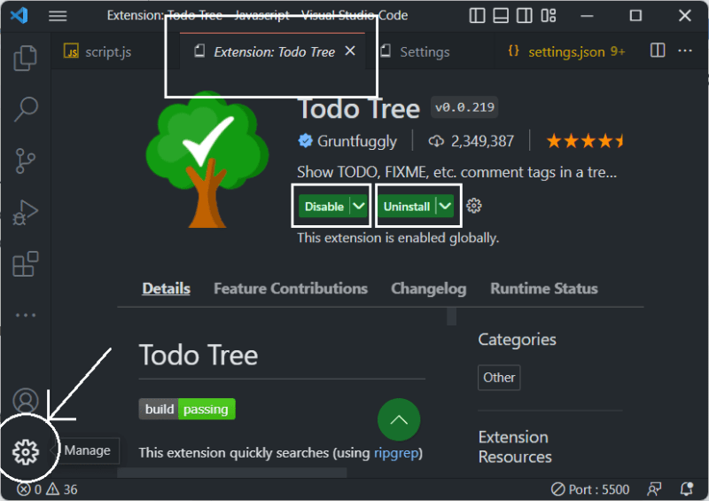

# Installation en vscode

{:width="500px" }
*Installation extensions en vscode*

<!-- note -->

Installation des extensions en VS code

<!-- new slide -->

## Markdown All in One

{:width="500px" }
*Markdown All in One*

<!-- note -->

Tout ce dont vous avez besoin pour Markdown (raccourcis clavier, table des matières, aperçu automatique et plus encore).

## Installation

- id : yzhang.markdown-all-in-one

<!-- new slide -->

## Références

- [Markdown All in One](https://marketplace.visualstudio.com/items?itemName=yzhang.markdown-all-in-one)
- [Documentation](https://markdown-all-in-one.github.io/docs/guide/#features)

<!-- new slide -->

## Todo Tree

{:width="500px" }
*Todo Tree*

<!-- note -->

Extension todo tree recherche rapidement (à l'aide de ripgrep) dans votre espace de travail des balises de commentaires telles que TODO et FIXME, et les affiche dans une arborescence dans la barre d'activité. La vue peut être glissée hors de la barre d'activité vers le volet de l'explorateur (ou partout où vous préférez qu'elle soit).

## Installation

- id : Gruntfuggly.todo-tree

<!-- new slide -->

## Références

- [Todo tree](https://marketplace.visualstudio.com/items?itemName=Gruntfuggly.todo-tree)
- [Todo tree vscode](https://dev.to/equiman/vscode-extension-todo-tree-1n02)

<!-- new slide -->
