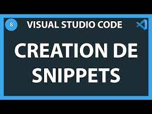
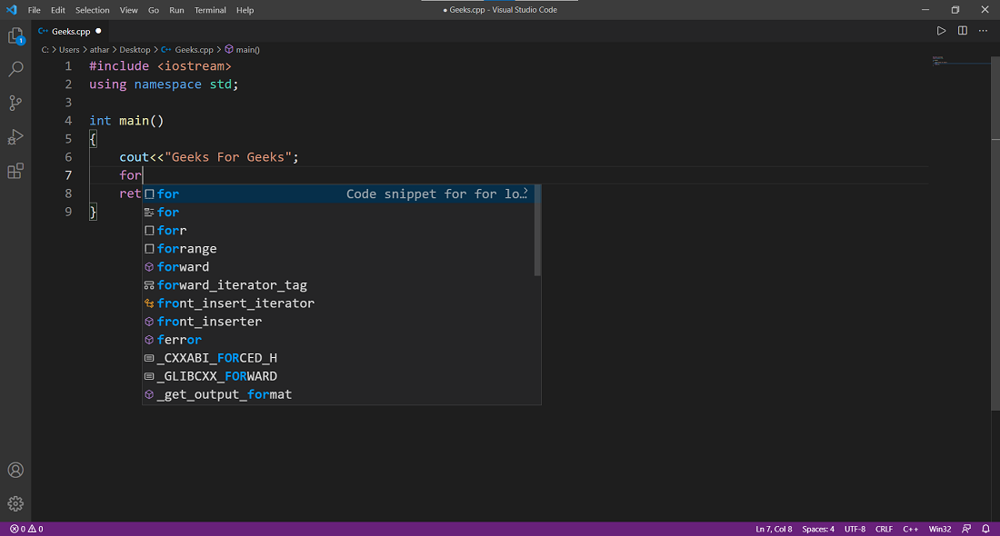

# Création de snippets

{:width="500px" }
*Création de snippets*

<!-- note -->

La création de snippets, ou extraits de code réutilisables, est une pratique courante pour améliorer l'efficacité et la productivité lors du développement web. Les snippets peuvent être utilisés pour des tâches récurrentes, des fonctions courantes ou des modèles de code complexes. 

<!-- new slide -->


## Les etapes de Création de snippets

{:width="500px" }
*Snippets en vscode*

<!-- note -->

Dans Visual Studio Code, vous pouvez créer un nouveau snippet en accédant à File > Preferences > User Snippets > New Global Snippets file. Ensuite, vous pouvez ajouter :

```json
{
    "Create HTML Link": {
        "prefix": "link",
        "body": [
            "<a href=\"$1\">$2</a>"
        ],
        "description": "Creates an HTML link with href attribute"
    }
}

```

<!-- new slide -->

## Références

- [Création de snippets](https://blog.stephane-robert.info/post/ansible-create-snippet-vscode/#:~:text=Pour%20cr%C3%A9er%20vos%20propres%20snippets,par%20exemple%20ansible%20ensuite%20valider.)
- [Documentation](https://code.visualstudio.com/docs/editor/userdefinedsnippets)

<!-- new slide -->

