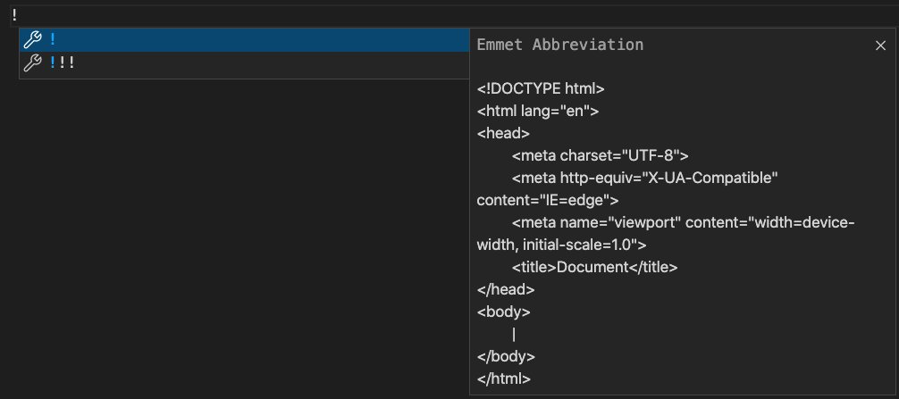
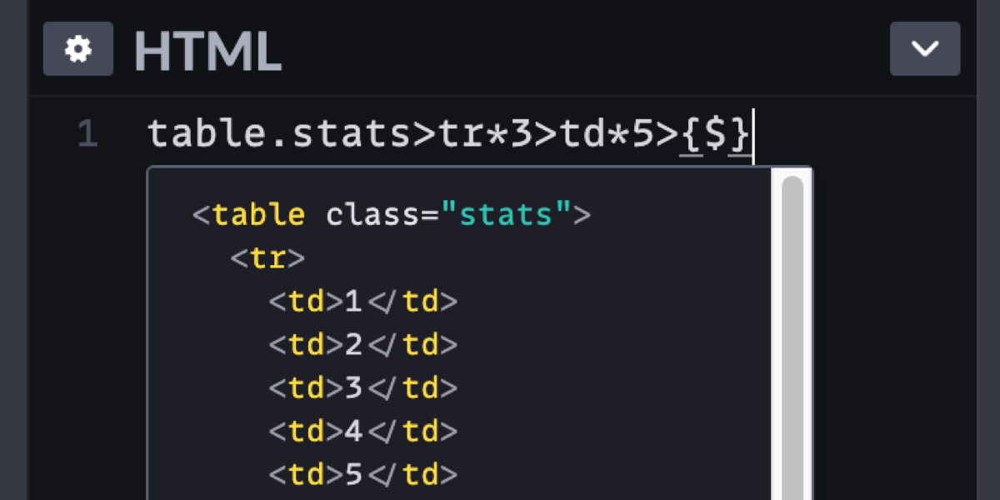
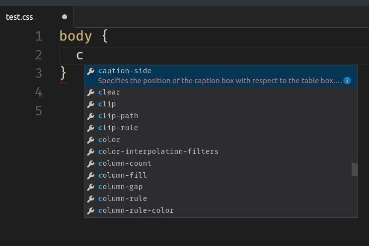

# Emmet vscode

{:width="500px" }
*Emmet vscode*

<!-- note -->

Emmet propose une large gamme d'abréviations et de commandes pour vous aider à générer rapidement du code HTML et CSS dans Visual Studio Code. Voici une liste de quelques abréviations et commandes Emmet couramment utilisées

<!-- new slide -->

## HTML Abbreviations:

{:width="500px" }
*HTML Abbreviations*

<!-- note -->

- **!** : Génère un modèle HTML de base.
- **html:5** : génère un doctype HTML5 avec une structure de base.
- **div** : génère un élément div.
- **p** : génère un élément de paragraphe p.
- **a** : génère un élément d'ancrage a.
- **img** : génère un élément d'image img.
- **ul>li*3** : génère une liste non ordonnée avec trois éléments de liste.
- **table>tr>td*3** : génère un tableau avec deux lignes et trois colonnes.
- **form>input:text+input:password+input:submit** : génère un formulaire avec saisie de texte, saisie de mot de passe et bouton de soumission.

<!-- new slide -->

## CSS Abbreviations:

{:width="500px" }
*CSS Abbreviations*

<!-- note -->

- **m10** : ajoute une marge de 10 px.
- **p20** : ajoute un remplissage de 20 px.
- **bgc** : définit la couleur d’arrière-plan.
- **w100** : définit la largeur sur 100 px.
- **h50** : définit la hauteur sur 50 px.
- **d:f** : définit l'affichage sur flex.
- **jc:c** : définit le contenu justifié au centre.
- **ai:c** : définit les éléments d'alignement au centre.
- **br** : Ajoute un rayon de bordure.
- **fsz** : définit la taille de la police.
- **ff** : définit la famille de polices.

<!-- new slide -->

## Références

- https://code.visualstudio.com/docs/editor/emmet
- https://docs.emmet.io/cheat-sheet/

<!-- new slide -->

